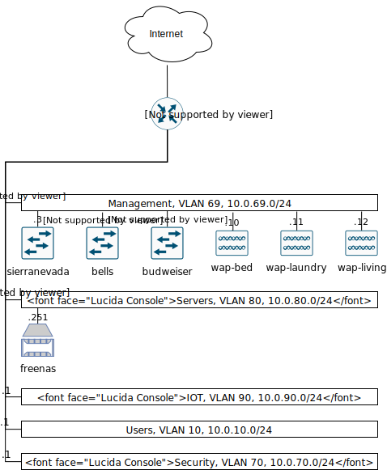

## Network Topology



## Configurations and Setup

### K8S

These are napkin notes; not a real guide.

```
- Setup ubuntu
- Install nfs-common on ubuntu
- Follow https://blog.alexellis.io/kubernetes-in-10-minutes/ but add user to docker group and dont specify IP

https://github.com/kubernetes/dashboard/blob/master/docs/user/access-control/creating-sample-user.md#creating-sample-user
- Use https://kubernetes.io/docs/tasks/access-application-cluster/web-ui-dashboard/ to setup the webui

- Use https://github.com/helm/charts/tree/master/stable/nfs-client-provisioner

helm install nfs stable/nfs-client-provisioner --set nfs.server=10.0.80.251 --set nfs.path=/mnt/media/k8s --set storageClass.defaultClass=true

https://github.com/containous/traefik-helm-chart

https://metallb.universe.tf/installation/

kubectl apply -f https://raw.githubusercontent.com/google/metallb/v0.8.3/manifests/metallb.yaml

apiVersion: v1
kind: ConfigMap
metadata:
  namespace: metallb-system
  name: config
data:
  config: |
    address-pools:
    - name: default
      protocol: layer2
      addresses:
      - 10.0.80.11-10.0.80.20

helm install prometheus-operator stable/prometheus-operator

helm install nginx stable/nginx-ingress

```

```
LB entry
apiVersion: networking.k8s.io/v1beta1
kind: Ingress
metadata:
  name: ingress-home-assistant
  annotations:
    # use the shared ingress-nginx
    kubernetes.io/ingress.class: "nginx"
spec:
  rules:
  - host: home.turnrye.com
    http:
      paths:
      - path: /
        backend:
          serviceName: home-assistant
          servicePort: 8123
```

### founders router configuration

```
# jan/05/2020 14:05:15 by RouterOS 6.45.6
# software id = 11Z6-3438
#
# model = RB4011iGS+
# serial number = AAB00A0BD36C
/interface bridge
add admin-mac=74:4D:28:32:24:68 auto-mac=no comment=defconf name=bridge vlan-filtering=yes
/interface vlan
add comment=clients interface=bridge name=vlan10 vlan-id=10
add comment=management interface=bridge name=vlan69 vlan-id=69
add comment=cameras interface=bridge name=vlan70 vlan-id=70
add comment=servers interface=bridge name=vlan80 vlan-id=80
/caps-man datapath
add bridge=bridge client-to-client-forwarding=yes local-forwarding=yes name=trusted-clients vlan-id=1 vlan-mode=no-tag
add bridge=bridge client-to-client-forwarding=no local-forwarding=yes name=guest-clients vlan-id=1 vlan-mode=no-tag
/caps-man configuration
add country="united states3" datapath=trusted-clients name=config-trusted security.authentication-types=wpa2-psk ssid=Turner
/interface ethernet switch port
set 0 default-vlan-id=0
set 1 default-vlan-id=0
set 2 default-vlan-id=0
set 3 default-vlan-id=0
set 4 default-vlan-id=0
set 5 default-vlan-id=0
set 6 default-vlan-id=0
set 7 default-vlan-id=0
set 8 default-vlan-id=0
set 9 default-vlan-id=0
set 10 default-vlan-id=0
set 11 default-vlan-id=0
/interface list
add comment=defconf name=WAN
add comment=defconf name=LAN
/interface wireless security-profiles
set [ find default=yes ] supplicant-identity=MikroTik
/ip pool
add name=default-dhcp ranges=192.168.88.10-192.168.88.254
add name=dhcp_pool1 ranges=10.0.10.2-10.0.10.254
add name=dhcp_pool2 ranges=10.0.20.2-10.0.20.254
add name=management-vpn ranges=10.0.69.200-10.0.69.254
add name=management-dhcp ranges=10.0.69.10-10.0.69.199
add name=vlan80 ranges=10.0.80.2-10.0.80.254
add name=vlan70 ranges=10.0.70.2-10.0.70.254
add name=ovpn-pool ranges=10.0.90.5-10.0.90.254
/ip dhcp-server
add address-pool=dhcp_pool1 disabled=no interface=vlan10 name=vlan10
add address-pool=management-dhcp disabled=no interface=vlan69 name=vlan69
add address-pool=vlan80 disabled=no interface=vlan80 name=vlan80
add address-pool=vlan70 disabled=no interface=vlan70 name=vlan70
/ppp profile
set *0 local-address=10.0.69.1 remote-address=management-vpn
add local-address=10.0.90.1 name=your_profile remote-address=ovpn-pool use-encryption=required
add local-address=10.0.80.1 name=management_profile remote-address=vlan80 use-encryption=required
/snmp community
set [ find default=yes ] addresses=10.0.0.0/8
/system logging action
set 3 remote=10.0.8.247 remote-port=5514
/caps-man manager
set enabled=yes
/caps-man provisioning
add action=create-dynamic-enabled master-configuration=config-trusted
/interface bridge port
add bridge=bridge comment=defconf interface=ether3
add bridge=bridge comment=defconf interface=ether4
add bridge=bridge comment=defconf interface=ether5
add bridge=bridge comment=defconf interface=ether6
add bridge=bridge comment=defconf interface=ether7
add bridge=bridge comment=defconf interface=ether8
add bridge=bridge comment=defconf interface=ether9
add bridge=bridge comment=defconf interface=ether10
add bridge=bridge comment=defconf interface=sfp-sfpplus1
/ip neighbor discovery-settings
set discover-interface-list=LAN
/interface bridge vlan
add bridge=bridge tagged=sfp-sfpplus1,bridge vlan-ids=69
add bridge=bridge tagged=sfp-sfpplus1,bridge vlan-ids=10
add bridge=bridge tagged=sfp-sfpplus1,bridge vlan-ids=80
add bridge=bridge tagged=sfp-sfpplus1,bridge vlan-ids=70
/interface l2tp-server server
set enabled=yes use-ipsec=required
/interface list member
add comment=defconf interface=bridge list=LAN
add comment=defconf interface=ether1 list=WAN
add interface=ether2 list=WAN
/interface ovpn-server server
set certificate=ser enabled=yes
/ip address
add address=10.0.69.1/24 interface=vlan69 network=10.0.69.0
add address=10.0.10.1/24 interface=vlan10 network=10.0.10.0
add address=10.0.80.1/24 interface=vlan80 network=10.0.80.0
add address=10.0.70.1/24 interface=vlan70 network=10.0.70.0
add address=10.0.90.1/24 interface=bridge network=10.0.90.0
/ip dhcp-client
add comment=defconf default-route-distance=15 dhcp-options=hostname,clientid disabled=no interface=ether1
add default-route-distance=10 dhcp-options=hostname,clientid disabled=no interface=ether2
/ip dhcp-server lease
add address=10.0.69.198 client-id=1:9c:b6:54:73:74:50 mac-address=9C:B6:54:73:74:50 server=vlan69
add address=10.0.69.197 client-id=1:0:26:b9:39:9:90 mac-address=00:26:B9:39:09:90 server=vlan69
add address=10.0.69.196 client-id=1:0:26:b9:39:9:88 mac-address=00:26:B9:39:09:88 server=vlan69
add address=10.0.80.247 client-id=ff:9f:6e:85:24:0:2:0:0:ab:11:f7:47:5f:c2:c5:95:c0:a4 mac-address=00:0C:29:33:C7:63 server=vlan80
add address=10.0.70.2 client-id=ff:2c:cd:1e:cb:0:2:0:0:ab:11:73:2c:8c:f0:ac:50:3:1f mac-address=74:83:C2:11:66:87 server=vlan70
add address=10.0.70.3 client-id=1:28:6d:97:7e:a8:3c mac-address=28:6D:97:7E:A8:3C server=vlan70
add address=10.0.10.237 client-id=1:b4:d5:bd:94:41:98 mac-address=B4:D5:BD:94:41:98 server=vlan10
add address=10.0.80.246 mac-address=00:0C:29:F0:26:1E server=vlan80
add address=10.0.80.251 client-id=1:0:1b:21:99:b0:e8 mac-address=00:1B:21:99:B0:E8 server=vlan80
add address=10.0.80.244 client-id=ff:9f:6e:85:24:0:2:0:0:ab:11:d8:8a:65:c1:ee:2c:cc:eb mac-address=00:0C:29:30:A0:09 server=vlan80
add address=10.0.10.220 client-id=1:48:a6:b8:a5:c6:fc mac-address=48:A6:B8:A5:C6:FC server=vlan10
add address=10.0.10.195 client-id=1:0:9:b0:b7:91:19 mac-address=00:09:B0:B7:91:19 server=vlan10
/ip dhcp-server network
add address=10.0.10.0/24 dns-server=10.0.10.1 gateway=10.0.10.1
add address=10.0.69.0/24 dns-server=10.0.69.1 domain=turnrye.com gateway=10.0.69.1
add address=10.0.70.0/24 dns-server=10.0.70.1 gateway=10.0.70.1
add address=10.0.80.0/24 dns-server=10.0.80.1 gateway=10.0.80.1
/ip dns
set allow-remote-requests=yes servers=8.8.8.8,8.8.4.4
/ip dns static
add address=10.0.69.1 name=founders.turnrye.com
add address=10.0.69.3 name=sierranevada.turnrye.com
add address=10.0.69.9 name=budweiser.turnrye.com
add address=10.0.69.5 name=bells.turnrye.com
add address=10.0.80.247 name=cloud.turnrye.com
add address=10.0.80.247 name=photos.turnrye.com
add address=10.0.80.247 name=ombi.turnrye.com
add address=10.0.80.247 name=home.turnrye.com
add address=10.0.80.247 name=plex.turnrye.com
add address=10.0.80.247 name=mqtt.turnrye.com
add address=127.0.0.1 name=ca-dev.autozone.com
add address=10.0.80.247 name=funkwhale.turnrye.com
/ip firewall filter
add action=drop chain=input disabled=yes dst-address=10.0.69.0/24 in-interface=bridge src-address=!10.0.69.0/24
add action=drop chain=forward disabled=yes dst-address=10.0.69.0/24 in-interface=bridge src-address=!10.0.69.0/24
add action=drop chain=input dst-port=53 in-interface-list=WAN protocol=udp
/ip firewall nat
add action=masquerade chain=srcnat comment="defconf: masquerade" ipsec-policy=out,none out-interface-list=WAN
add action=dst-nat chain=dstnat dst-port=80 in-interface-list=WAN protocol=tcp to-addresses=10.0.80.247 to-ports=80
add action=dst-nat chain=dstnat dst-port=443 in-interface-list=WAN protocol=tcp to-addresses=10.0.80.247 to-ports=443
add action=dst-nat chain=dstnat dst-port=32400 in-interface-list=WAN protocol=tcp to-addresses=10.0.80.244 to-ports=32400
add action=dst-nat chain=dstnat dst-port=8883 in-interface-list=WAN protocol=tcp to-addresses=10.0.80.247 to-ports=8883
add action=masquerade chain=srcnat dst-address=10.0.80.244 dst-port=32400 out-interface-list=LAN protocol=tcp src-address=10.0.0.0/8
add action=dst-nat chain=dstnat dst-port=22 in-interface-list=WAN protocol=tcp to-addresses=10.0.80.247 to-ports=22
/ip service
set telnet disabled=yes
set ftp disabled=yes
set www disabled=yes
set api disabled=yes
set api-ssl disabled=yes
/ip ssh
set forwarding-enabled=remote
/ip traffic-flow
set cache-entries=16k
/ip traffic-flow target
add dst-address=10.0.80.247 version=5
/ppp secret
add name=turnrye profile=your_profile
/snmp
set enabled=yes
/system clock
set time-zone-name=America/Chicago
/system identity
set name=founders
/system logging
add action=remote topics=!debug,!snmp,!dns
add action=echo topics=!debug,!snmp,!dns
/tool mac-server
set allowed-interface-list=LAN
/tool mac-server mac-winbox
set allowed-interface-list=LAN
/tool romon
set enabled=yes
```
